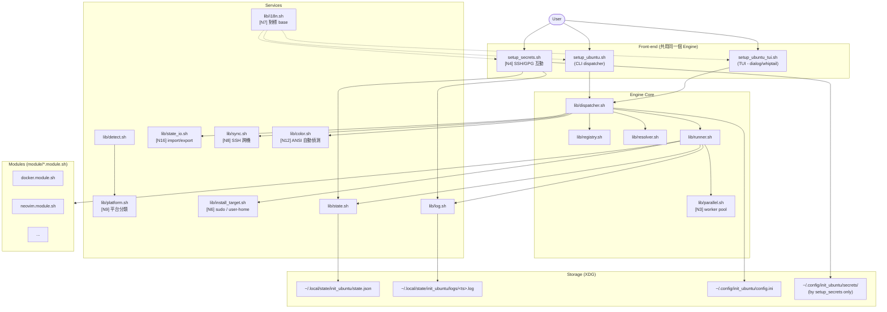
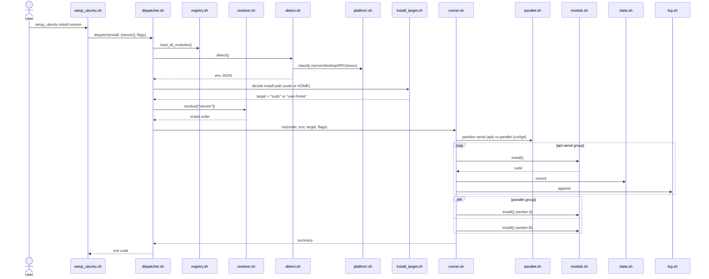
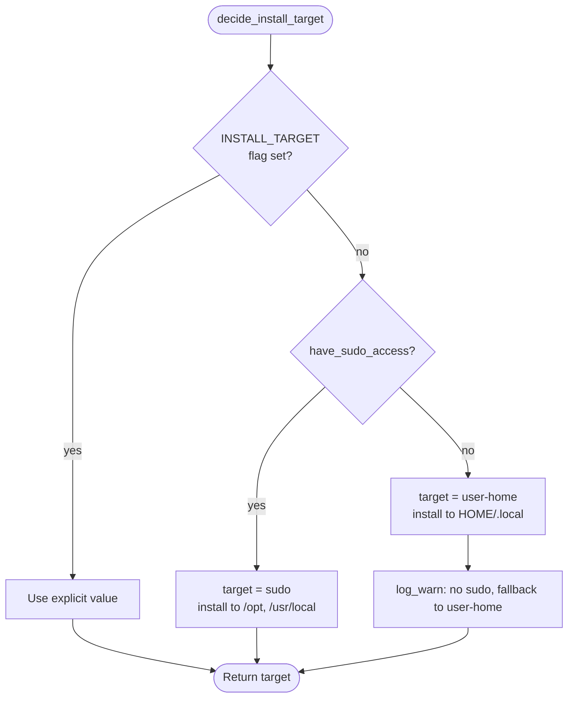
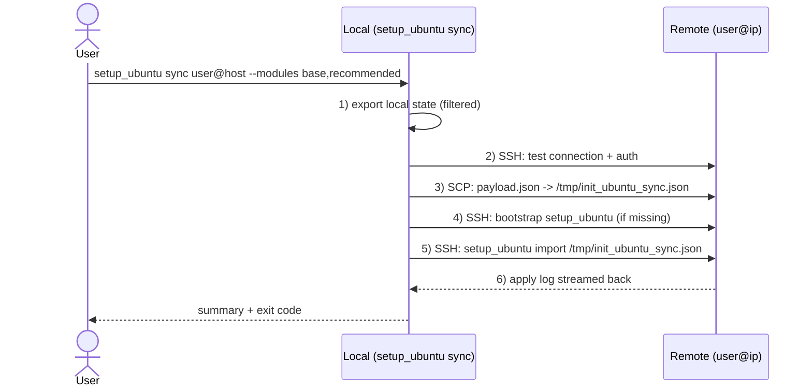
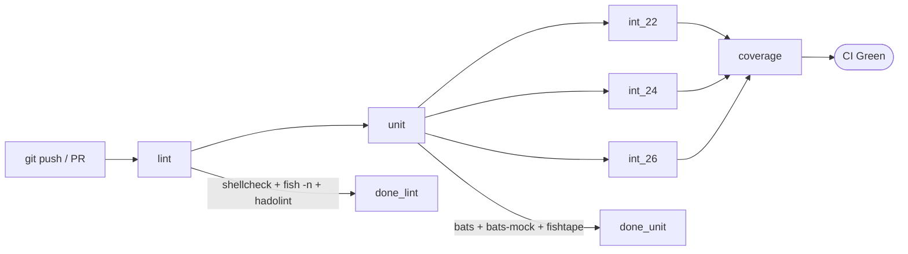

# Architecture: init_ubuntu

> 本文檔說明 `init_ubuntu` 工具的內部結構、資料流、與測試邊界。閱讀 PRD(`doc/prd/init-ubuntu.prd.md`)以了解產品需求,本文則聚焦於**如何實現**。
>
> **本版整合 PRD 補充的 N1-N19 新需求**(apt-style subcommand、Ubuntu 26.04、敏感工具、non-sudo fallback、server/desktop 雙模式、多平台、sync、ANSI 自動偵測、tag 分組 TUI、import/export 提前等)。每個新增/修訂段落會以 `[N#]` 標出對應的需求編號,便於追溯。

---

## 1. 系統概觀



### 設計原則

1. **CLI、TUI、Secrets-tool 三個前端共用同一個 Engine** — 業務邏輯絕不分散在前端
2. **Module 是 plug-in** — Engine 只認契約(`doc/module-spec.md`),module 增刪不需要改 engine
3. **狀態無副作用** — state.json 是真實狀態的**快取**,實況以 `is_installed()` 為準
4. **Sudo 集中在 module 內** — Engine 不直接 `sudo`;module 若無 sudo 走 user-home fallback [N6]
5. **可測試性優先** — 所有 module 內呼叫的系統 helper 都可被 `bats-mock` 攔截
6. **裝完之後仍能自管** [N15] — 安裝後 `setup_ubuntu` 與 `setup_ubuntu_tui` 持續可用作 management entry,可隨時 install / remove / status / sync

---

## 2. 目錄佈局(目標狀態)

```
initialization/
├── setup_ubuntu.sh                     # CLI entry
├── setup_ubuntu_tui.sh                 # TUI entry
├── setup_secrets.sh                    # [N4] 敏感資訊互動工具
├── lib/
│   ├── dispatcher.sh                   # subcommand 派發
│   ├── registry.sh                     # module 掃描與載入
│   ├── resolver.sh                     # 依賴解析(拓樸排序)
│   ├── runner.sh                       # install/remove/purge 執行流
│   ├── parallel.sh                     # [N3] non-apt 並行 worker pool
│   ├── detect.sh                       # 環境偵測
│   ├── platform.sh                     # [N9] server/desktop/RPi/Jetson/WSL 分類
│   ├── install_target.sh               # [N6] sudo vs user-home 決策
│   ├── state.sh                        # state.json R/W
│   ├── state_io.sh                     # [N16] import / export
│   ├── sync.sh                         # [N8] SSH push / pull
│   ├── log.sh                          # 雙寫:stdout + file
│   ├── i18n.sh                         # [N7] _t() + _detect_lang(),對標 base
│   ├── i18n/
│   │   ├── en.sh
│   │   └── zh-TW.sh
│   ├── color.sh                        # [N12] ANSI 偵測 + escape
│   ├── tui_backend.sh                  # dialog/whiptail wrapper
│   ├── secrets.sh                      # setup_secrets 共用 helper
│   ├── general.sh                      # 從 module/function/general.sh 遷移
│   └── logger.sh                       # 從 module/function/logger.sh 遷移
├── module/
│   ├── apt-essentials.module.sh        # base (依平台動態挑套件 [N9])
│   ├── shell.module.sh                 # base
│   ├── docker.module.sh                # recommended
│   ├── nvidia-driver.module.sh         # recommended (含 dual-check + 失敗回復 [N17])
│   ├── fish.module.sh                  # recommended
│   ├── neovim.module.sh                # recommended (含 nvimdots 推薦勾選)
│   ├── font.module.sh                  # recommended
│   ├── lazygit.module.sh               # optional
│   ├── lazydocker.module.sh            # optional
│   ├── fzf.module.sh                   # optional
│   ├── eza.module.sh                   # optional
│   ├── zoxide.module.sh                # optional
│   ├── batcat.module.sh                # optional
│   ├── fdfind.module.sh                # optional
│   ├── yazi.module.sh                  # optional
│   ├── fnm.module.sh                   # optional (拆自 neovim)
│   ├── vscode.module.sh                # optional (從 recommended 降級)
│   ├── codex.module.sh                 # optional [N10]
│   ├── gemini.module.sh                # optional [N10]
│   ├── claude-code.module.sh           # optional [N10]
│   ├── qmk-firmware.module.sh          # optional
│   ├── anydesk.module.sh               # optional
│   ├── tmux.module.sh                  # optional
│   ├── ssh-config.module.sh            # optional
│   ├── git-config.module.sh            # optional
│   ├── claude-code-config.module.sh    # optional
│   ├── trash-maintenance.module.sh     # experimental
│   └── config/                         # module 依賴的 config 檔
│       ├── neovim/
│       ├── fish/
│       └── ...
├── template/
│   ├── module-apt.template.sh         # archetype A: apt packages
│   ├── module-github-release.template.sh # archetype B: GitHub release tarball
│   ├── module-config.template.sh      # archetype C: config file drop
│   ├── module-custom.template.sh      # archetype D: hand-written lifecycle
│   ├── test.template.bats              # 新 test 範本
│   └── README.md
├── test/
│   ├── helpers/common.bash
│   ├── unit/
│   │   ├── dispatcher_spec.bats
│   │   ├── registry_spec.bats
│   │   ├── resolver_spec.bats
│   │   ├── runner_spec.bats
│   │   ├── parallel_spec.bats          # [N3]
│   │   ├── detect_spec.bats
│   │   ├── platform_spec.bats          # [N9]
│   │   ├── install_target_spec.bats    # [N6]
│   │   ├── state_spec.bats
│   │   ├── state_io_spec.bats          # [N16]
│   │   ├── sync_spec.bats              # [N8]
│   │   ├── color_spec.bats             # [N12]
│   │   ├── i18n_spec.bats
│   │   ├── secrets_spec.bats           # [N4]
│   │   └── modules/
│   │       └── ...
│   ├── integration/
│   │   ├── install_cycle_spec.bats
│   │   ├── dependency_resolution_spec.bats
│   │   ├── tui_keystrokes_spec.bats
│   │   ├── sync_e2e_spec.bats          # [N8]
│   │   └── matrix/
│   │       ├── ubuntu-22.04.Dockerfile
│   │       ├── ubuntu-24.04.Dockerfile
│   │       └── ubuntu-26.04.Dockerfile # [N2]
│   └── smoke/
│       └── help_output_spec.bats
├── dockerfile/
│   └── Dockerfile.test-tools           # 從 base repo 借用 + 客製
├── script/
│   └── ci/
│       └── ci.sh                       # 從 base repo 借用 + 客製
├── doc/
│   ├── architecture.md                 # 本檔
│   ├── module-spec.md
│   ├── TESTING.md
│   ├── MODULE-DEV.md
│   ├── SYNC.md                         # [N8] sync 設計與安全性
│   ├── SECRETS.md                      # [N4] setup_secrets 使用手冊
│   └── PLATFORMS.md                    # [N9] 支援平台與差異
├── doc/prd/init-ubuntu.prd.md       # (was .claude/prds/ before)
├── .github/workflows/ci.yaml
├── Makefile
├── compose.yaml
├── .codecov.yaml
├── .hadolint.yaml
├── README.md
└── LICENSE
```

---

## 3. 核心資料流

### 3.1 `install` 流程(沿用,補上 parallel + install_target)



### 3.2 apt-style subcommand 對應表 [N1]

對標 apt,但**只覆蓋有意義的子集**(本工具不是 apt 替代品):

| 我們的 subcommand | 對標 apt | 行為差異 |
|---|---|---|
| `install <m>` | `apt install <pkg>` | 接 module name(不是 apt 套件名) |
| `remove <m>` | `apt remove <pkg>` | 保留 module 自管的 config |
| `purge <m>` | `apt purge <pkg>` | 連 config 一起清 |
| `update` | `apt update` | 重新掃描 module/ 目錄、刷新 GitHub release 版本快取(**不**動 apt 套件清單) |
| `upgrade [<m>]` | `apt upgrade` | 重裝 latest 版的 module(用各 module 的 `install()` 重跑) |
| `search <kw>` | `apt search` | 在 NAME / DESCRIPTION / TAGS 內搜尋 |
| `show <m>` | `apt show` | 印出 module 完整 metadata |
| `list` | `apt list` | 列出 module(含分層、狀態) |
| `status [<m>]` | (無對應) | 列已裝 module + 版本 |
| `detect` | (無對應) | 環境偵測 |
| `doctor` | (無對應) | 健康檢查 |
| `config load` | (無對應) | [A6] 批次套用 module/config/* |
| `sync <user@ip>` | (無對應) | [N8] 跨機同步 |
| `import <file>` / `export <file>` | (無對應) | [N16] state 匯出入 |
| `help` / `version` | `apt --help` / `apt --version` | 標準 |

### 3.3 環境偵測流程(擴增平台分類)[N9]

```mermaid
flowchart TD
    start([detect_environment])
    start --> os[OS: lsb_release]
    os --> arch[Arch: uname -m]
    arch --> cpu[CPU: lscpu]
    cpu --> gpu[GPU: lspci grep -E 'VGA|3D']
    gpu --> board[Board: /proc/device-tree/model<br/>+ /etc/nv_tegra_release<br/>+ dmidecode]
    board --> desktop[Desktop: XDG_CURRENT_DESKTOP]
    desktop --> session[Session: XDG_SESSION_TYPE]
    session --> virt[Virt: systemd-detect-virt]
    virt --> wsl[WSL: /proc/sys/fs/binfmt_misc/WSLInterop]
    wsl --> form[platform.classify -> form_factor]
    form --> json[Build JSON]
    json --> emit([Emit])
```

`platform.classify()` 回傳 `form_factor`,合法值:
- `desktop` — 有桌面環境(`$XDG_CURRENT_DESKTOP` 非空)
- `server` — 無桌面環境,x86_64,非 SBC
- `rpi-4` / `rpi-5` — 樹莓派
- `jetson-orin` — Jetson Orin 系列
- `wsl` — Windows Subsystem for Linux
- `container` — 容器內
- `vm` — 虛擬機(非容器)
- `unknown` — 偵測失敗

範例 JSON 片段:

```json
{
  "os": { "id": "ubuntu", "version": "24.04", "codename": "noble" },
  "arch": "x86_64",
  "form_factor": "desktop",
  "gpu": { "vendor": "nvidia", "model": "RTX 4090" },
  "desktop": "GNOME",
  "session_type": "x11",
  "virt": "none",
  "wsl": false,
  "board": null
}
```

### 3.4 Install target 決策 [N6]



CLI 旗標:`--install-target=auto|sudo|user-home`(預設 `auto`)。

Module 內讀取:

```bash
install() {
    case "${INIT_UBUNTU_INSTALL_TARGET}" in
        sudo)
            sudo apt-get install -y mypkg
            ;;
        user-home)
            curl -fsSL https://example.com/mypkg.tar.gz \
                | tar -xz -C "${HOME}/.local"
            export PATH="${HOME}/.local/bin:${PATH}"
            ;;
    esac
}
```

**注意**:不是所有 module 都能 user-home(如 docker 必須系統級)。Module 在 metadata 宣告 `SUPPORTS_USER_HOME=true|false`;engine 在偵測無 sudo 時自動跳過 `SUPPORTS_USER_HOME=false` 的 module 並警告使用者。

### 3.5 Sync 流程 [N8]



Payload schema(`payload.json`):

```json
{
  "version": "0.1.0",
  "source_host": "yc-workstation",
  "source_user": "cyc",
  "exported_at": "2026-05-13T15:00:00+08:00",
  "modules": [
    { "name": "docker", "manual": false },
    { "name": "neovim", "manual": false },
    { "name": "fish", "manual": false }
  ],
  "include_config": false
}
```

**安全性原則**:
- payload **絕不含**敏感資料(SSH key / token / 個人 config 內的 secrets)
- 由 `setup_secrets.sh` 另開獨立流程處理敏感資料(`setup_secrets sync ...` v1.x)
- SSH 連線**只用既有 key**,不在工具內存任何 password
- 對方執行前一律 `--dry-run` 預覽,使用者確認後才實際 install
- 加 `--strict-host-key-checking=yes`,拒絕 unknown host

### 3.6 Import / export [N16]

```bash
# Export 當前狀態
setup_ubuntu export ~/my-state.json

# Import 到新機器
setup_ubuntu import ~/my-state.json

# 同等於
setup_ubuntu install $(jq -r '.modules[].name' my-state.json)
```

Import 流程同 sync §3.5 步驟 5-6,但跑在本機(不過 SSH)。

### 3.7 `remove` 流程(同前)

`remove` 只移除目標 module(不連動 dep),除非 `--with-orphans`。

### 3.8 `purge` 流程(同前)

與 `remove` 相同,但呼叫 `purge()` 而非 `remove()`,且會額外清除 module 的 config 目錄。

---

## 4. CLI 與 TUI 為何能共享同一個 Engine

關鍵設計:**前端只負責收集「意圖」,所有「動作」都委派給 dispatcher**。

### CLI 路徑

```
argv -> parse_cli_args() -> intent { subcommand, modules, flags }
     -> dispatcher.dispatch(intent)
```

### TUI 路徑

```
TUI prompts -> collect_tui_selections() -> intent { subcommand, modules, flags }
            -> dispatcher.dispatch(intent)
```

### Secrets-tool 路徑 [N4]

```
setup_secrets.sh -> dispatcher.secrets_dispatch(intent)
                 -> 不走 install pipeline,有獨立的 secrets pipeline
```

三者最終都進入 dispatcher,Engine 邏輯一致。

---

## 5. Module 動態載入機制

`registry.sh` 在啟動時掃描 `module/*.module.sh`:

1. `bash -n` 語法檢查
2. `source` 到 sub-shell 並讀取 metadata
3. 註冊到關聯陣列(`MODULES_NAME`、`MODULES_DEPS`、`MODULES_CATEGORY`、`MODULES_TAGS`)
4. 真正執行 lifecycle 時才**再** source(隔離 sub-shell)

### 5.1 TUI 內按 tag 分組 [N13]

TUI 在 Optional 與 Advanced 選單中,先按 `TAGS` 主標籤分組顯示,避免使用者面對長長一條清單:

```
+- Optional Modules -----------------------------------------+
|                                                            |
|  monitor:                                                  |
|    [ ] btop         (top alternative)                      |
|    [ ] htop                                                |
|    [ ] nvtop        (GPU monitor)                          |
|                                                            |
|  cli:                                                      |
|    [ ] eza          (ls alternative)                       |
|    [ ] zoxide       (cd alternative)                       |
|    [ ] batcat                                              |
|                                                            |
|  agent:                                                    |
|    [ ] claude-code                                         |
|    [ ] codex                                               |
|    [ ] gemini                                              |
|                                                            |
|  <  Apply  >   <  Back  >                                  |
+------------------------------------------------------------+
```

主標籤 = `TAGS[0]`;若 module 同時屬於多個 tag,只在第一個 tag 群組顯示(避免重複勾選混淆)。

### 5.2 為什麼不一次 source 全部

- 避免 module A 的變數覆寫 module B
- 避免某 module 的副作用影響 engine
- 讓 module 可以放心用任意全域變數名

---

## 6. 狀態管理

### 6.1 三個來源的真實狀態

| 來源 | 角色 | 信任度 |
|---|---|---|
| `state.json` | 安裝快取 + metadata | 中 |
| `is_installed()` | 系統實況 | 高 |
| `dpkg -l` / `command -v` | 系統實況 | 高 |

**優先序:`is_installed()` > `state.json`**。

### 6.2 並行寫入保護

`state.json` 修改用 `flock`:

```bash
exec 200>"${STATE_LOCK}"
flock -x 200
# ... read / modify / write ...
exec 200>&-
```

### 6.3 Schema 版本升級 [Q-A2]

`state.json` 內含 `version` 欄位。啟動時若偵測舊版:
1. 備份原檔為 `state.json.bak.<oldver>`
2. 依序跑各個 `lib/migrations/v0.X_to_v0.Y.sh`
3. 寫入新檔

### 6.4 Import / Export schema [N16]

`export` 輸出 = `state.json` 的子集(`modules` 部分),格式同 §3.5。`import` 反向。

---

## 7. 測試邊界

### 7.1 三層測試

```mermaid
graph LR
    subgraph unit["test/unit/ (用 bats-mock)"]
        u1[engine logic]
        u2[module lifecycle 各別]
        u3[helpers]
        u4[sync/import/export]
    end

    subgraph integration["test/integration/ (Ubuntu container 內真實裝)"]
        i1[install + idempotency]
        i2[install -> remove -> install]
        i3[purge cleans config]
        i4[dep resolution end-to-end]
        i5[sync e2e (mock SSH server)]
    end

    subgraph smoke["test/smoke/"]
        s1[help output]
        s2[detect runs]
        s3[list --json valid]
    end

    unit -->|fast| dev[Developer]
    smoke -->|every commit| ci[CI]
    integration -->|matrix: 22.04 / 24.04 / 26.04| ci
```

### 7.2 Mock 策略(擴增)

| 命令 | Mock | 用途 |
|---|---|---|
| `apt-get` | 不執行,記參數 | 驗證裝了哪些套件 |
| `curl` / `wget` | 不執行,印 URL | 驗證下載哪些檔案 |
| `sudo` | 透傳但記錄 | 驗證 sudo 範圍 |
| `systemctl` | 不執行 | 驗證 service 操作 |
| `dpkg -l` | stub | 模擬已裝/未裝 |
| `lspci` | stub | NVIDIA 偵測 |
| `systemd-detect-virt` | stub | 容器/VM 偵測 |
| `lsb_release -rs` | stub | Ubuntu 版本切換(22/24/26) |
| `/proc/device-tree/model` | tmpfile | RPi / Jetson 偵測 [N9] |
| `ssh` / `scp` | stub | sync 流程 [N8] |
| `tty` | stub | ANSI 自動偵測 [N12] |

### 7.3 Integration test boundary [N2]

- 矩陣:`ubuntu:22.04` / `ubuntu:24.04` / `ubuntu:26.04`
- 容器內**真實執行**完整流程
- 排除硬體相關(NVIDIA driver、QMK)
- `docker run --rm` 每次乾淨

### 7.4 Fish 測試(同前)

- 純函式 → fishtape
- Config 性質 → `fish -n` + `fish_indent --check`

### 7.5 Sync E2E 測試 [N8]

用 `linuxserver/openssh-server` 容器當對端:
- compose 起 2 個容器(client / server)
- client 內跑 `setup_ubuntu sync root@server`
- assert server 內 state.json 含預期 module

---

## 8. CI/CD Pipeline



### 8.1 Lint 階段

- `shellcheck -x` 對所有 `*.sh`
- `fish -n` + `fish_indent --check` 對所有 `*.fish`
- `hadolint` 對 `Dockerfile.test-tools`

### 8.2 Unit 階段

- 全在 `test-tools:local` image 內跑
- 全部 mock 系統呼叫
- 跑 `kcov` 量測覆蓋率

### 8.3 Integration 矩陣 [N2]

三個 job:`ubuntu-22.04` / `ubuntu-24.04` / `ubuntu-26.04`

### 8.4 Coverage gate

| 階段 | 門檻 |
|---|---|
| v0.1 | >= 80% |
| v0.5 | >= 90% |
| v1.0 | >= 95% |
| 之後 | >= 99%(允許 1% 為硬體相關不可測) |

---

## 9. Error handling 與 Logging contract

### 9.1 Engine 層

- 所有 `lib/*.sh` 用 `set -euo pipefail`
- 不可恢復錯誤 → `log_fatal` + 非零 exit code
- 部分 module 失敗時,其他 module 繼續跑;結尾彙報(exit 6)

### 9.2 Module 層

- Module 用 `return 非零` 上報失敗
- 可呼叫 `log_warn`,**不可** `log_fatal`
- 不可 `exit`(會 kill engine)

### 9.3 失敗回復 [N17]

部分 module(如 `nvidia-driver`)失敗會讓系統處於無法開機狀態。對這類**高風險** module:

```bash
# module/nvidia-driver.module.sh
RISK_LEVEL="high"          # 標記為高風險;engine pre-install 顯示 WARN_MESSAGE
declare -gA WARN_MESSAGE=(
    [en]="If install fails, manually switch back to 'nouveau' via the kernel command-line."
    [zh-TW]="若安裝失敗,請從 grub 切回 'nouveau' 驅動進入系統。"
)

install() {
    _snapshot_kernel_modules > "${BACKUP_DIR}/lsmod.before"
    sudo apt-get install -y nvidia-driver-XXX || {
        log_error "nvidia-driver install failed, restoring nouveau..."
        _restore_kernel_modules "${BACKUP_DIR}/lsmod.before"
        return 1
    }
}
```

> v0.1 不要求自動回滾(複雜度過高,見 §18 與 PRD §13 Q12);`RECOVERY_FALLBACK` metadata 欄位已砍,fallback hint 改用 `WARN_MESSAGE`(pre-install)與 `POST_INSTALL_MESSAGE`(install 後)i18n list 表達。

`RISK_LEVEL=high` 的 module 必須:
- 在 install 前快照可回復狀態
- 失敗時自動嘗試回復
- CLI / TUI 對使用者顯示「即將執行高風險操作」確認

**Snapshot 範圍(預設三層;見 §18.1 Q-A11):**

1. `lsmod` 輸出 → `${BACKUP_DIR}/lsmod.before`(kernel module 載入狀態)
2. `apt-mark showmanual` 輸出 → `${BACKUP_DIR}/apt-manual.before`(使用者手動裝的套件清單)
3. 關鍵 config 目錄備份 → `${BACKUP_DIR}/etc/{X11,modprobe.d}/`(X server 設定 + driver 黑名單)

**可選的第四層**:在 high-risk install 的確認對話框內,使用者可勾選「**Also create system-level snapshot (BTRFS / timeshift)**」(預設**不勾**)。若勾選且系統有對應工具:

- BTRFS root → 自動 `btrfs subvolume snapshot / /.snapshots/init_ubuntu_<ts>`
- `timeshift` 已裝 → 自動 `sudo timeshift --create --comments "init_ubuntu pre-install <module>"`
- 都沒有 → log_warn「No snapshot backend available; proceed without system-level snapshot」

### 9.4 Log 格式(JSONL,structured logging)

Log **檔案存的是 JSON Lines**(`.jsonl`),主要使用對象是 **agent**(Claude / Codex / Gemini)做問題診斷;stdout 同時印人類可讀單行格式(`tee` 模式)。

```jsonl
{"ts":"2026-05-13T14:22:33+08:00","level":"info","module":"docker","event":"install_start","payload":{"version":"apt-managed","install_target":"sudo","dry_run":false}}
{"ts":"2026-05-13T14:22:34+08:00","level":"info","module":"docker","event":"cmd_exec","payload":{"cmd":"sudo apt-get update","exit":0,"duration_ms":1430}}
{"ts":"2026-05-13T14:22:45+08:00","level":"info","module":"docker","event":"cmd_exec","payload":{"cmd":"sudo apt-get install -y docker-ce ...","exit":0,"duration_ms":11200}}
{"ts":"2026-05-13T14:23:02+08:00","level":"info","module":"docker","event":"install_done","payload":{"status":"ok"}}
```

Schema 見 PRD §10.2。常見 events:
- `session_start` / `session_end`(engine 層,`module=null`)
- `install_start` / `install_done` / `install_failed`
- `cmd_exec`(每次 `exec_cmd` 呼叫)
- `dep_resolved`(resolver 完成拓樸排序)
- `snapshot_taken` / `recovery_triggered`(`RISK_LEVEL=high` module)
- `sync_push` / `sync_pull`(sync 流程)

---

## 10. Sudo policy [N6]

- **Engine 不直接呼叫 `sudo`**
- Module 內 `sudo` 必須最小範圍
- 不可 `sudo -i` / `sudo -s`
- 啟動時 `have_sudo_access`:
  - 有 sudo → 預設 `INSTALL_TARGET=sudo`
  - 無 sudo → 預設 `INSTALL_TARGET=user-home`,警告使用者
- 拒絕 root 跑 entrypoint:

```bash
if [[ "${EUID}" -eq 0 ]]; then
    log_fatal "Do not run as root. Run as regular user; sudo will be requested per-module."
    exit 4
fi
```

### 10.1 User-home install 規範

當 `INSTALL_TARGET=user-home`:
- 二進位 → `$HOME/.local/bin/`
- 函式庫 → `$HOME/.local/lib/`
- 資料 → `$HOME/.local/share/`
- Config → `$HOME/.config/<module>/`(**統一規則 [N14]**)
- Module 必須在 `install()` 結尾印出:`PATH must include $HOME/.local/bin`

### 10.2 模組支援宣告

每個 module metadata 加:

```bash
SUPPORTS_USER_HOME=true   # 或 false
```

`false` 的 module(如 `docker`、`nvidia-driver`):無 sudo 時跳過整個 module + 警告。

### 10.3 `apt-essentials` 的特殊處理(見 §18.1 Q-A12)

`apt-essentials` 是 base 層,內含一組 apt 套件(`git` / `vim` / `curl` / `wget` / ...)。無 sudo 時的處理**不採用「整個 module 跳過」**,而是**逐套件檢查**:

```bash
# module/apt-essentials.module.sh (節選邏輯)
install() {
    local _failed=() _skipped=() _ok=()
    for pkg in "${APT_PKGS[@]}"; do
        if _pkg_installed_with_min_version "${pkg}"; then
            _ok+=("${pkg}")            # 已裝且版本 OK → 略過
        elif [[ "${INIT_UBUNTU_INSTALL_TARGET}" == "sudo" ]]; then
            if sudo apt-get install -y "${pkg}"; then
                _ok+=("${pkg}")
            else
                _failed+=("${pkg}")    # 裝失敗
            fi
        else
            _skipped+=("${pkg}")       # 無 sudo + 無法裝 → 跳過該套件
        fi
    done

    # 結尾彙報
    log_info "apt-essentials summary: ok=${#_ok[@]}, skipped=${#_skipped[@]}, failed=${#_failed[@]}"
    [[ ${#_skipped[@]} -gt 0 ]] && log_warn "Skipped (please install manually): ${_skipped[*]}"
    [[ ${#_failed[@]} -gt 0 ]] && log_error "Failed: ${_failed[*]}"
}
```

- **已裝 + 版本 OK** → 略過此套件,繼續其他
- **沒裝且可 sudo** → 嘗試 `apt install`
- **沒裝且無 sudo** → 跳過該**套件**(不是整個 module fail),警告使用者手動裝
- **install 結束時彙報**:哪些套件 ok / 跳過 / 失敗(進 log + stdout)

其他 base / recommended module 可選擇繼續嘗試或 fail-fast,視 module 自身策略;`apt-essentials` 因為是「最低基線」所以採盡力而為的策略。

---

## 11. i18n(對標 base i18n.sh) [N7]

### 11.1 介面

`lib/i18n.sh` 模仿 `ycpss91255-docker/base/script/docker/i18n.sh`:

```bash
# Source the dict for the detected language
_detect_lang()    # echoes detected lang code
_LANG="$(_detect_lang)"
# shellcheck source=/dev/null
source "${LIB_DIR}/i18n/${_LANG}.sh"

# Caller uses:
_t install.start "docker"  # printf-style with key + args
```

### 11.2 字典檔

```bash
# lib/i18n/zh-TW.sh
declare -A I18N=(
    [install.start]="開始安裝 %s..."
    [install.success]="%s 安裝成功"
    [install.failed]="%s 安裝失敗,詳見 %s"
    [purge.confirm]="即將完整移除 %s(包含 config),確定?"
    [sudo.missing.warn]="未偵測到 sudo 權限,將改裝至 %s"
    [sync.connecting]="連接 %s..."
    [secrets.ssh.prompt]="輸入 SSH key passphrase:"
)
```

### 11.3 偵測優先序

1. `--lang=<n>` CLI flag
2. `$INIT_UBUNTU_LANG`
3. `~/.config/init_ubuntu/config.ini` 的 `[ui] lang`
4. `$LC_ALL` / `$LC_MESSAGES` / `$LANG`
5. 預設 `en`

### 11.4 Module 雙語描述

Module 提供 `DESCRIPTION_EN` / `DESCRIPTION_ZH_TW`,engine 依當前語言取。

---

## 12. ANSI / Color [N12]

`lib/color.sh` 在所有輸出前判斷:

```bash
_should_color() {
    [[ "${INIT_UBUNTU_NO_COLOR:-}" == "1" ]] && return 1
    [[ "${NO_COLOR:-}" == "1" ]] && return 1            # https://no-color.org/
    [[ "${TERM:-}" == "dumb" ]] && return 1
    [[ ! -t 1 ]] && return 1                            # 非 tty (pipe / cron)
    return 0
}
```

CLI 旗標 `--color=auto|always|never`(預設 `auto`,套用上述判斷)。

---

## 13. 整合與擴充

### 13.1 第三方 module(v1.x)

`setup_ubuntu module add <git-url>`,clone 到 `~/.local/share/init_ubuntu/modules/`。

### 13.2 與 base repo 的關係

只**借用 4 個檔案**:`Dockerfile.test-tools` / `Makefile.ci` / `script/ci/ci.sh` / `.codecov.yaml`。i18n 設計**對標**但不直接 copy(因為 base 的 i18n 對應 Docker container repo 用途,我們是 host installer)。

### 13.3 與既有 `general.sh` 整合

| 既有函式 | 新位置 |
|---|---|
| `check_in_WSL` / `check_in_docker` / `check_in_mac` | `lib/detect.sh` |
| `get_system_param` | `lib/detect.sh` |
| `exec_cmd` / `have_sudo_access` / `backup_file` | `lib/general.sh` |
| `create_temp_file` / `check_pkg_status` | `lib/general.sh` |
| `setup_apt_mirror` / `apt_pkg_manager` | `lib/general.sh` |
| `get_github_pkg_latest_version` | `lib/general.sh` |

**不重寫,只搬位置 + 補測試**。

---

## 14. 平台偵測(server / desktop / RPi / Jetson) [N9]

### 14.1 偵測來源

| 平台 | 偵測方法 |
|---|---|
| `desktop` | `$XDG_CURRENT_DESKTOP` 非空 |
| `server` | 桌面為空 + x86_64 + 無 SBC 標記 |
| `rpi-4` / `rpi-5` | `cat /proc/device-tree/model` 含 `Raspberry Pi 4/5` |
| `jetson-orin` | `/etc/nv_tegra_release` 存在,且 `cat /proc/device-tree/model` 含 `Orin` |
| `wsl` | `/proc/sys/fs/binfmt_misc/WSLInterop` 存在 |
| `container` | `systemd-detect-virt --container --quiet` |
| `vm` | `systemd-detect-virt --vm --quiet` |

### 14.2 推薦策略

```bash
is_recommended() {
    case "${INIT_UBUNTU_FORM_FACTOR}" in
        desktop)            # 給 desktop 推薦
            return 0
            ;;
        server|jetson-orin) # server 與 Jetson 跳過 GUI 類
            return 1
            ;;
        rpi-*)              # RPi 個別決定
            return 0
            ;;
        wsl|container)      # 容器內跳過 host-only
            return 1
            ;;
    esac
}
```

### 14.3 平台選擇互動 [N9]

Engine 啟動時:
- **CLI 模式**:自動偵測,但提供 `--profile=server|desktop|jetson` 強制覆寫
- **TUI 模式**:在 System Info 畫面顯示偵測結果,**詢問使用者是否同意**(允許覆寫)
- `~/.config/init_ubuntu/config.ini` 可 pin `[platform] override=server`

### 14.4 平台差異化的 module 行為

| Module | 在 desktop | 在 server | 在 jetson-orin | 在 wsl |
|---|---|---|---|---|
| `apt-essentials` | + GUI 相關套件 | 純 CLI 套件 | Jetson SDK 加套件 | 純 CLI |
| `nvidia-driver` | 推薦(若有卡) | 推薦(若有卡) | **不裝**(Jetson 已內建) | 不推薦 |
| `font` | 推薦 | 不裝 | 不裝 | 不裝 |
| `docker` | 推薦 | 推薦 | 推薦(NVIDIA Container Toolkit 變體) | 推薦(用 Docker Desktop integration) |

詳見 `doc/PLATFORMS.md`(將於 Phase 7 補齊)。

---

## 15. Sensitive Tools(`setup_secrets.sh`) [N4]

### 15.1 範疇

獨立 sub-tool,管理:
- SSH key 生成(`ed25519` 預設)
- SSH key 載入(`ssh-add`)
- GPG key 生成 / 匯入
- GitHub PAT / GitLab token / API token 安全儲存(`pass` / `gnome-keyring` / 自建 encrypted file)
- 互動式輸入密碼(`stty -echo` 或 `dialog --passwordbox`)

### 15.2 子命令

```bash
setup_secrets ssh-key generate                # 互動產 SSH key
setup_secrets ssh-key load                    # 把 key 加入 ssh-agent
setup_secrets ssh-key copy <user@host>        # ssh-copy-id
setup_secrets gpg generate                    # 產 GPG key
setup_secrets token set <name>                # 互動輸入並儲存 token
setup_secrets token get <name>                # 取出(stdout,小心 history)
setup_secrets list                            # 列出已存的 secrets(名稱,不含值)
setup_secrets remove <name>
```

### 15.3 儲存後端

- 優先 `pass`(if installed)
- 次選 `gnome-keyring`(if available)
- 最終 fallback:`age` / `openssl enc` 加密檔放 `~/.config/init_ubuntu/secrets/<name>.enc`

**禁止**儲存明文。

### 15.4 與主 engine 的關係

- 共用 `lib/logger.sh` / `lib/i18n.sh` / `lib/color.sh`
- **不**走 module pipeline(因為 secrets 不是「安裝某個套件」)
- 但 `setup_ubuntu_tui` 主選單可以提供「Manage Secrets」入口跳轉到 `setup_secrets`

### 15.5 安全性

- 永遠不寫 secrets 到 log
- 互動 input 不在 process arg 內(避免 `ps` 看到)
- 加密用的 key 從使用者 passphrase 推導(`argon2id` KDF)
- 對 `--dry-run` 仍提示但不寫入

詳見 `doc/SECRETS.md`(將於 Phase 後段補齊)。

---

## 16. Sync 機制 [N8]

### 16.1 設計目標

跨機快速同步「裝了哪些 module」,但**不傳 secrets**。

### 16.2 子命令

```bash
# Push 本機狀態到對端
setup_ubuntu sync <user@host> [--modules base,recommended] [--include-config] [--dry-run]

# Pull 對端狀態到本機
setup_ubuntu sync <user@host> --pull
```

### 16.3 Bootstrap

對端可能沒裝 `setup_ubuntu`。流程:

1. SSH 連線測試
2. `which setup_ubuntu` on remote
3. 若不存在:
   - rsync 本工具到 `~/init_ubuntu_bootstrap/`(只傳 lib/ + module/ + setup_ubuntu.sh)
   - 或下載最新 release tarball
4. 跑 `setup_ubuntu import payload.json`

### 16.4 SSH 安全

- 必須 `--strict-host-key-checking=yes`
- 認證**只支援 key**,不收 password(避免在工具流程內輸入)
- 不在工具內呼叫 `ssh-copy-id`;若沒 key 上線 fail fast 提示「先用 `setup_secrets ssh-key copy ...`」

### 16.5 Payload 內容

詳見 §3.5。

詳見 `doc/SYNC.md`(將於後續補齊)。

---

## 17. Parallel Install [N3 — 不做]

v0.1+ 一律序列。`dpkg` lock + sudo 互斥讓 apt module 無法並行;非 apt module 並行收益不足以抵 scheduler 複雜度。`PARALLEL_GROUP` metadata 欄位已從 module spec 移除(見 PRD §5.2 / §13.2 Q22)。

---

## 18. 開放問題與決定

### 18.1 已決定(來自 PRD 收斂後的設計題)

| # | 問題 | **決定** |
|---|---|---|
| Q-A7 [N8] | sync payload 是否要簽章? | **v0.1 不考慮**;後續若有擴大 user 範圍再評估(加 GPG signature) |
| Q-A8 [N4] | secrets 主要後端? | **偵測順序嘗試**:`pass` > `gnome-keyring` > encrypted-file(自動找最好用的);使用者可在 `~/.config/init_ubuntu/config.ini` 寫 `[secrets] backend=pass` 強制指定 |
| Q-A9 [N9] | RPi / Jetson 是 allowlist 還是 is_recommended? | **allowlist**:`SUPPORTED_PLATFORMS` 為硬限制;沒列就視為不支援(可 `--force` 強裝)。**支援與否的依據**:做 CI 測試 / 看官方資訊確認;沒有官方資訊的就用 CI 測試 |
| Q-A10 [N3] | 並行安裝預設啟用嗎? | **v0.1 預設關閉**;後續再評估要不要啟動或**直接取消功能**(取決於使用體驗) |
| Q-A11 [N17] | 高風險 module 自動回復的「snapshot」要做到多深? | **預設記前三層**(`lsmod` + `apt-mark showmanual` + 關鍵 config `/etc/X11`、`/etc/modprobe.d`)。**使用者在 install 確認對話框內可勾選是否額外做全機 snapshot**(BTRFS / timeshift),預設不做,需明確選擇 |
| Q-A12 [N6] | Non-sudo 模式下 `apt-essentials` 怎麼辦? | **檢查每個套件是否已裝且符合最低版本**:已裝 + 版本 OK → 略過此套件繼續其他安裝;沒裝且無法 `apt install` → **跳過該套件**(不是整個 module fail)。**結尾彙報**:哪些套件成功 / 跳過 / 失敗 |

### 18.2 設計階段傾向(尚未經使用者確認,屬於實作層細節)

| # | 問題 | 我的傾向 |
|---|---|---|
| Q-A1 | resolver 用 Kahn 還是 DFS topo sort? | **Kahn** |
| Q-A2 | state.json schema migration 策略 | 一個 schema 版本一個 migrator,自動 migrate + 備份 |
| Q-A3 | TUI dep 鏈是否遞迴展開 | 預設折疊,提供「展開」按鈕 |
| Q-A4 | log 保留多久 | 預設 30 天 / 100 個檔,類 logrotate |
| Q-A5 | Module-local i18n? | v0.1 不做 |
| Q-A6 [N7] | i18n 字典是 bash declare -A 還是外部 JSON? | bash declare -A(對標 base) |
